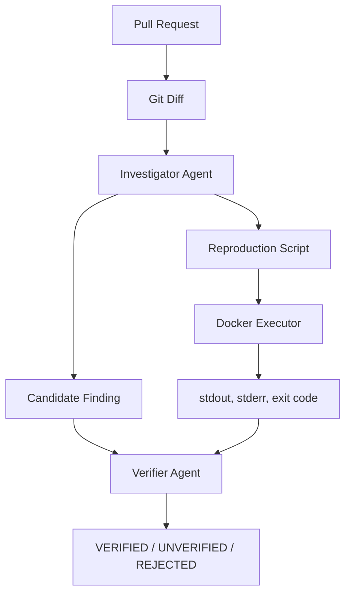

# ProofPR

AI code review, backed by evidence.

## Problem
Traditional AI code review often produces plausible warnings, but cannot prove whether the reported issue actually occurs. This results in developers wasting time investigating false positives or dismissing critical bugs because they look like hallucinations.

## Solution
ProofPR treats important review findings as hypotheses. Instead of stopping at "I think this is a bug", ProofPR investigates the claim, generates a reproduction test, executes it in a sandboxed Docker environment, collects evidence, and uses a verifier to prove or disprove the claim.

## Architecture



## Tech Stack
- **Backend:** TypeScript, Node.js 22 LTS, npm, Commander.js, Zod, Vitest, Gemini LLM, Docker
- **Frontend:** React, TypeScript, Vite, Tailwind CSS, Lucide React, Recharts

## Installation

```bash
git clone https://github.com/Vector0808/proofPR.git
cd proofPR
npm install
npm run build
```

## Environment Variables
Create a `.env` file in the root directory:
```
LLM_PROVIDER=gemini
LLM_MODEL=gemini-3.6-Flash
GEMINI_API_KEY=your_api_key_here
```

## CLI
```bash
# Run a Baseline V0 Review
proofpr baseline --repo /path/to/repo --base main --head feature-branch

# Run an Agentic ProofPR Review
proofpr review --repo /path/to/repo --base main --head feature-branch

# Run Benchmark Evaluation
proofpr evaluate --cases benchmark/cases
```

## Frontend Dashboard
Start the entire full-stack application (API and Vite server) simultaneously:
```bash
npm run dev
```
Navigate to `http://localhost:5173`.

## Docker
ProofPR requires Docker Desktop to execute reproductions securely. 
If Docker is unavailable, the pipeline falls back gracefully, assigning an `UNVERIFIED` status to findings and surfacing the infrastructure error.

## Benchmark and Evaluation
We evaluate ProofPR against a suite of benchmark cases. The system automatically measures **Verified Finding Precision**, Recall, False Positive Rate, and Reproduction Success.

## Limitations
- Reproduction generation works best in environments where the AI can correctly guess the module system (CommonJS vs ESM) and the project's dependencies.
- Docker execution is limited to Node.js sandboxing for the hackathon MVP.

## Future Work
- Support for multiple execution runtimes (Python, Go, Rust).
- Integration directly into GitHub PR workflows via GitHub Apps.
- Secure multi-container execution for database integration tests.
